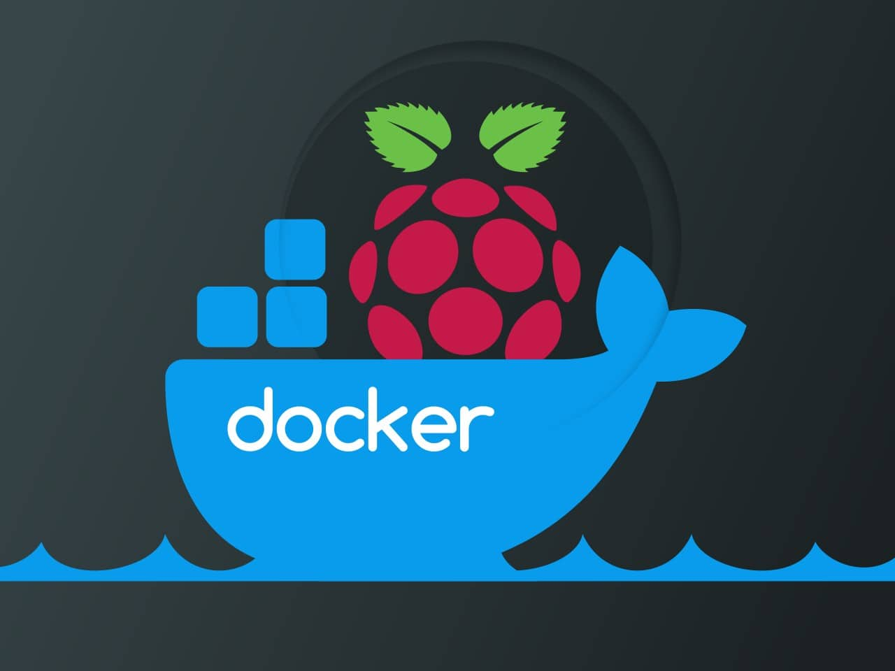

<p align="center">
    
</p>

# docker-raspios-lite

This project builds and publishes Docker images for Raspberry Pi OS Lite on [Docker Hub](https://hub.docker.com/).

## Supported Architectures

The following tags are available on Docker Hub under
[webdavis/raspio-lite](https://hub.docker.com/repository/docker/webdavis/docker-raspios-lite/general):

| Docker Tags | Architecture   | OS Variant     | Target Devices                       |
| ----------- | -------------- | -------------- | ------------------------------------ |
| `arm64`     | `arm64`        | 64-bit         | Raspberry Pi 3, 4, 400, 5, and newer |
| `armv7`     | `linux/arm/v7` | 32-bit (armhf) | Most Raspberry Pi models             |
| `armv6`     | `linux/arm/v6` | 32-bit (armel) | Raspberry Pi Zero, Pi 1, legacy...   |

## Setup／Installation

This project assumes that both
[Docker](https://docs.docker.com/desktop/setup/install/mac-install/) and
[Buildx](https://github.com/docker/buildx) are installed.

On macOS, you can install Docker Desktop (which includes Buildx) via Homebrew:

```bash
brew install --cask docker-desktop
```

Once installed, launch **Docker Desktop** to complete the setup (accepting licenses and etc.),
before running builds.

## Raspberry Pi OS Lite Root File System

The latest root file system for Raspberry Pi OS Lite is available as `root.tar.xz` in the
[Raspberry Pi - Official Downloads Archive](https://downloads.raspberrypi.com/raspios_lite_arm64/archive/).

Just click on the latest version (or most recent date).

## Linting

This project uses [Hadolint](https://github.com/hadolint/hadolint) to enforce `Dockerfile` best
practices.

Hadolint can be installed using Homebrew:

```bash
brew install hadolint
```

### Running Hadolint

To lint the [`Dockerfile`](./Dockerfile), run:

```bash
hadolint Dockerfile
```

Linting rules for this project are defined in the [`.hadolint.yaml`](./.hadolint.yaml)
file.

## Local Builds

Use the [`docker-wrapper.sh`](./docker-wrapper.sh) script to build and inspect project images.

### Build Images Locally

```bash
./docker-wrapper.sh
```

### List Local Project Architectures

```bash
./docker-wrapper.sh -p
```

### List Remote Image Architectures (Docker Hub Manifests)

```bash
./docker-wrapper.sh -r
```

> \[!NOTE\]
> Commands that access Docker Hub require you to be logged in via `docker login`.
